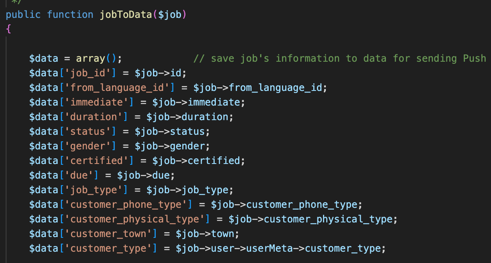

# DigitalTolk Technical Exam

## Problem

Do at least ONE of the following tasks: refactor is mandatory. Write tests is optional, will be good bonus to see it.
Upload your results to a Github repo, for easier sharing and reviewing.

## Code to refactor

1) `app/Http/Controllers/BookingController.php`
2) `app/Repository/BookingRepository.php`

## Code to write tests (optional)

3) `App/Helpers/TeHelper::willExpireAt`
4) `App/Repository/UserRepository::createOrUpdate`

## Solution

In the `refactor` folder, I created a new Laravel Project and added the 4 classes based on their namespace
`DTApi\Some\Other\Directory` in the `src` folder. Please see the `composer.json` for more details.

The unit tests was placed in the `refactor/tests` folder. 
                                                                                            

I initially refactored the source code and I know this refactoring could take a lot of time.
So i decided to share my whole insights via `Code Review Analysis`

## Code Review Analysis

There are areas in the codebase that could benefit from refactoring to improve readability and maintainability.

**Controllers**
- Leverage Laravel Validation, this can be done via built-in validation rules.
Utilize form request classes.

- Inject the abstract implementation not the concrete classes or follow the Dependency Inversion Principle.

- Use the `auth()->user()` helper method to check the authenticated user, do not pass it directly from the request.

- Wrong usage of if/else statement.
- Do not get the env values directly. Please your env variables in a config file.

- Use typehints for arguments and return.

- Create slim controllers, make use of a service to inject the actual logic.

- Don't import undefined classes.

- Use proper status code for the response.

**Repository**

- Adhere to Single Responsibility Principle. Don't add unrelated actions to the repository, 
like validation, email sending, notifications, etc. Separate it into a new class.

- Utilize the Laravel Logger, you can create a custom logger depending on your needs.
- The constructor should have a public modifier.

- Use typehints for arguments and return.

- Catch any exceptions in try/catch.

- Always use mass assignment for filling the model properties. Do not access the property directly.
- Use new array syntax.

- Avoid nested if/else. 

- Utilize Laravel HTTP Class, create this client in a separate class.

**Test Class**

- Avoid nested if/else statements.

- Utilize query scopes.

Overall, the codebase should follow SOLID Principles and follow best practices in coding in able to attain scalability, reusability, traceability and readability.
Please maximize the framework features and capabilities.

`Do not reinvent the wheel.`

